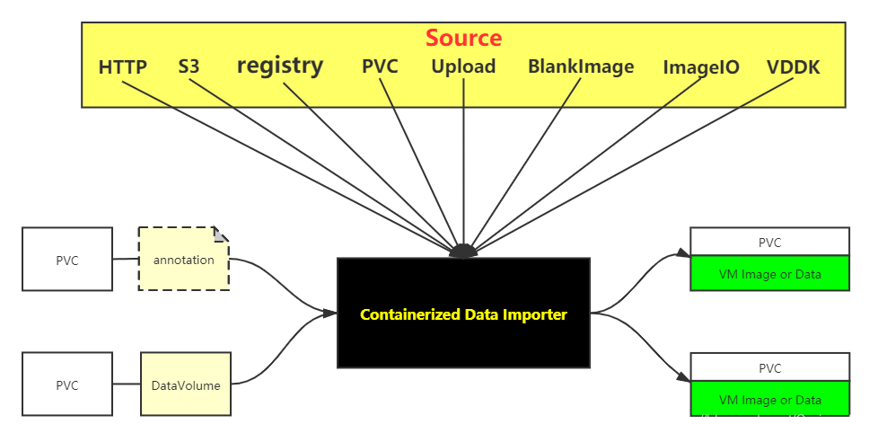

## 如何使用CDI

下面一张图我们可以了解CDI能够做什么：

{ loading=lazy }

我们把CDI当成一个黑盒，站在使用者的角度来观察它。用户可以通过两种方式使用CDI，分别是：

- 在PVC上添加`annotation`
- 创建`DataVolume`（CDI新增的CRD）实例

CDI始终做以下事情：

- 监听到PVC的`annotation`或者`DataVolume`
- 根据定义，从指定的`Source`，将VM Image或者其他数据导入到PVC中

通过`DataVolume`使用CDI的方式，可以通过版本管理API接口，便于其他项目（例如：kubevirt）与之集成，只需要指定特定版本的`DataVolume`即可，所有对`DataVolume`的修改都将体现在新的API版本上。

如果对`DataVolume`的数据结构感兴趣可以前往[DataVolume]。

[DataVolume]: resource/dataVolume.md
