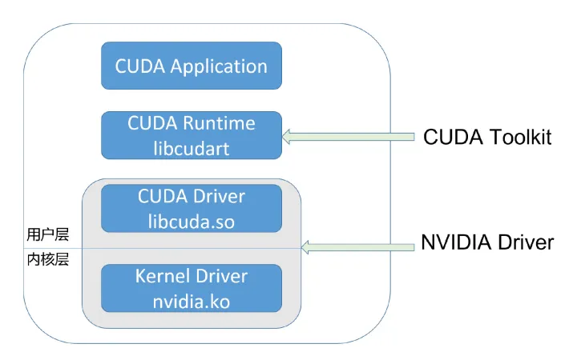
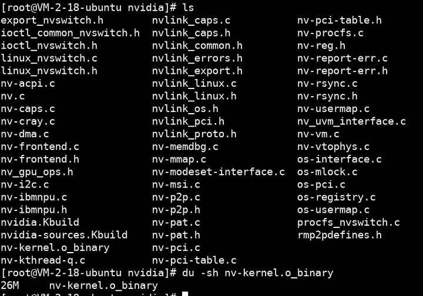
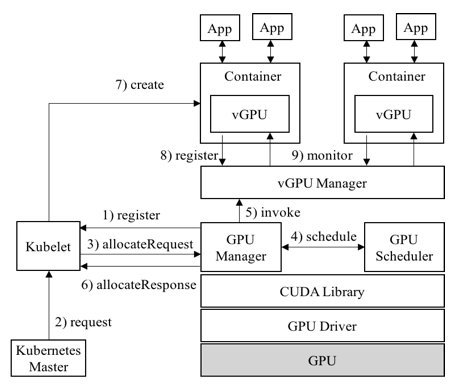
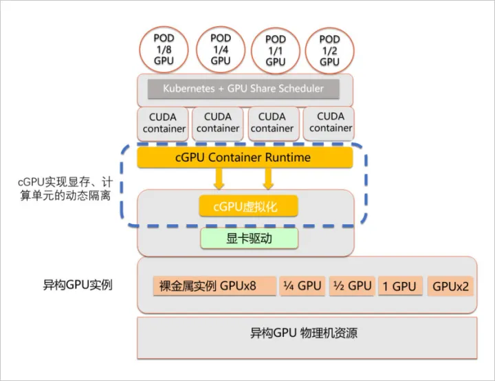
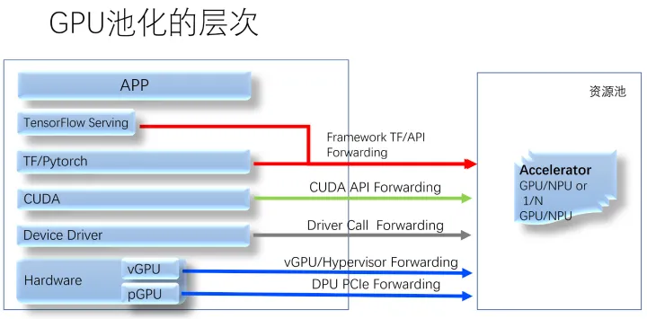

首先，我们这里谈到的，都是 nVidia 生产的 GPU、都只考虑 CUDA 计算场景。其次，这里的虚拟化指的是 OS 虚拟化的容器技术，不适用于 KATA 这样的、基于系统虚拟化的安全容器。

其次，我们的技术目标就是希望：

- 吃干榨尽所有资源
- 覆盖所有业务场景
- 提升业务总体表现

## CUDA的生态

{ loading=lazy }

CUDA 开发者使用的，通常是 CUDA Runtime API，它是 high-level 的；而 CUDA Driver API 则是 low-level 的，它对程序和 GPU 硬件有更精细的控制。Runtime API 是对 Driver API 的封装。

CUDA Driver 即是 `UMD`，它直接和 `KMD` 打交道。两者都属于 NVIDIA Driver package，它们之间的 ABI，是 NVIDIA Driver package 内部的，不对外公开。

英伟达软件生态封闭：

- 无论是 nvidia.ko，还是 `libcuda.so`，还是 `libcudart`，都是被剥离了符号表的
- 大多数函数名是加密替换了的
- 其它的反调试、反逆向手段

以 `nvidia.ko` 为例，为了兼容不同版本的 Linux 内核 API，它提供了相当丰富的兼容层，于是也就开源了部分代码:

{ loading=lazy }

其中这个 26M 大小的、被剥离了符号表的 `nv-kernel.o_binary`，就是 GPU 驱动的核心代码，所有的 GPU 硬件细节都藏在其中。

## vCUDA和友商cGPU

为了让多个容器可以共享同一个 GPU，为了限定每个容器能使用的 GPU 份额，业界出现了不同的方案，典型的如 vCUDA 和 cGPU：

vCUDA架构:

{ loading=lazy }

cGPU 架构：

{ loading=lazy }

两者的实现策略不同，cGPU 比 vCUDA 更底层，从而实现了不侵入用户环境。

## GPU池化

{ loading=lazy }

以 CUDA API 转发的池化方案、业界某产品为例，它到了 GPU 所在的后端机器上，由于一个 GPU 卡可能运行多个 GPU 任务，这些任务之间，依然需要有算力隔离。它为了实现这一点，在后端默认启用了 nVidia MPS —— 也就是故障隔离最差的方案。这会导致什么？一个 VM 里的 CUDA 程序越界访问了显存，一堆风马牛不相及的 VM 里的 CUDA 应用就会被杀死。

所以，很显然，GPU 池化也必须以同时满足故障隔离和算力隔离的方案作为基础。

## 算力隔离

