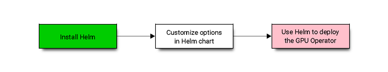

## 先决条件

在安装 GPU Operator 之前，您应该确保 Kubernetes 集群满足一些先决条件。

1. Kubernetes 集群中的所有工作节点必须运行相同的操作系统版本才能使用 NVIDIA GPU 驱动程序容器。 或者，如果您在节点上预安装 NVIDIA GPU 驱动程序，则可以运行不同的操作系统。
2. 节点必须配置容器引擎，例如 Docker CE/EE、`cri-o` 或 `containerd`。 对于 docker，请遵循官方[安装说明](https://docs.docker.com/engine/install/)。
3. 节点功能发现 (NFD) 是每个节点上 Operator 的依赖项。 默认情况下，NFD master 和worker 由 Operator 自动部署。 如果 NFD 已在集群中运行，则您必须在安装 Operator 时禁用部署 NFD。
    
    确定 NFD 是否已在集群中运行的一种方法是检查节点上的 NFD 标签：
    ```bash
    kubectl get nodes -o json | jq '.items[].metadata.labels | keys | any(startswith("feature.node.kubernetes.io"))'
    ```
    如果命令输出为 `true`，则 NFD 已在集群中运行。

4. 要在 Kubernetes 1.13 和 1.14 中进行监控，请启用 kubelet `KubeletPodResources` [特性门控](https://kubernetes.io/docs/reference/command-line-tools-reference/feature-gates/)。 从 Kubernetes 1.15 开始，默认启用。

!!! warning "注意"

    要启用 `KubeletPodResources` 特性门控，请运行以下命令： 
    ```bash
    echo -e "KUBELET_EXTRA_ARGS=--feature-gates=KubeletPodResources=true" | sudo tee /etc/default/kubelet
    ```

在 NVIDIA vGPU 上安装 GPU Operator 之前，请确保满足以下条件。

1. NVIDIA vGPU 主机驱动程序版本 12.0（或更高版本）预安装在托管 NVIDIA vGPU 加速的 Kubernetes 工作节点虚拟机的所有虚拟机管理程序上。 有关详细信息，请参阅 NVIDIA vGPU 文档。
2. 已安装 NVIDIA vGPU 许可证服务器，并且可从所有 Kubernetes 工作节点虚拟机访问该服务器。
3. 私有注册表可用于上传 NVIDIA vGPU 特定驱动程序容器映像。
4. 集群中的每个 Kubernetes 工作节点都可以访问私有注册表。 私有注册表访问通常通过 `imagePullSecrets` 进行管理。 有关更多信息，请参阅 Kubernetes 文档。 用户需要在 `values.yaml` 文件的驱动程序部分中向 NVIDIA GPU-Operator 提供这些机密。
5. 需要 Git 和 `Docker/Podman` 从源存储库 (Repo) 构建 vGPU 驱动程序映像并将其推送到本地注册表。

!!! warning "注意"

    将 NVIDIA vGPU 驱动程序上传到公开可用的存储库或以其他方式公开共享该驱动程序违反了 NVIDIA vGPU EULA。

## Helm部署

部署 GPU Operator 的首选方法是使用 helm。

```bash
$ curl -fsSL -o get_helm.sh https://raw.githubusercontent.com/helm/helm/master/scripts/get-helm-3 \
   && chmod 700 get_helm.sh \
   && ./get_helm.sh
```
现在，添加 NVIDIA Helm 存储库 (Repo)：
```bash
$ helm repo add nvidia https://helm.ngc.nvidia.com/nvidia \
   && helm repo update
```

GPU Operator Helm 图表提供了许多可自定义的选项，可以根据您的环境进行配置。

{ loading=lazy }

### Chart自定义选项

