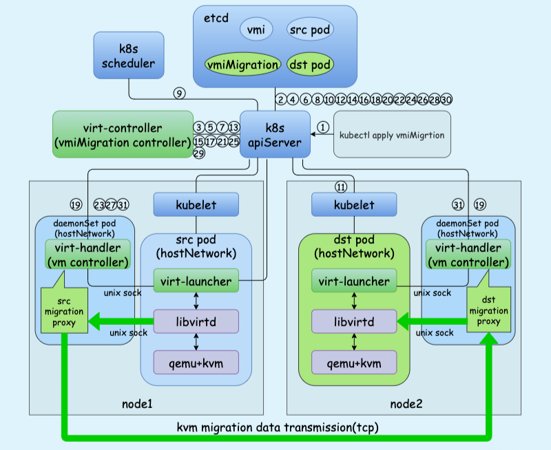

# VirtualMachineInstanceMigration

## 迁移问题

!!! info "虚拟机迁移"

    虚拟机迁移一般是指因宿主机出现故障时，需要将上面运行的虚拟机迁移到其它宿主机上的过程。

在做虚拟机迁移前，首先需要考虑迁移前后宿主机的硬件资源差异性，包括宿主机架构（x86、ARM等）、宿主机cpu类型（Intel、AMD等）等因素，这部分内容需要结合具体业务场景具体分析，不在本文讨论范围内。

除去硬件资源差异，kubeVirt虚拟机迁移还需要考虑以下问题：

??? question "kubevirt如何做kvm迁移？"

    kubeVirt的kvm虚拟机是运行在pod中的，为了实现kvm迁移，kubevirt定义了一个叫作`VirtualMachineInstanceMigration`的CRD。用户如果想迁移kubeVirt kvm，编写一个`VirtualMachineInstanceMigration`对象apply即可，apply后对应的controller会在其它节点创建一个新的kvm pod，之后再做切换，从而完成kvm的迁移。

??? question "迁移过程对业务的影响?"

    迁移可以分为冷迁移（`offline migration`，也叫常规迁移、离线迁移）和热迁移（`live migration`，也叫动态迁移、实时迁移），冷迁移在迁移之前需要将虚拟机关机，然后将虚拟机镜像和状态拷贝到目标宿主机，之后再启动；热迁移则是将虚拟机保存（save）/回复（restore），即将整个虚拟机的运行状态完整的保存下来，拷贝到其它宿主机上后快速的恢复。热迁移相比于冷迁移，对业务来说几乎无感知。

    kubeVirt的`VirtualMachineInstanceMigration`支持`live migration`，官方资料可参考《Live Migration in KubeVirt》

??? question "数据对迁移的限制？"

    这里说的数据主要考虑内存数据、系统盘/数据盘数据，系统盘和数据盘如果使用了宿主机的本地盘（如SSD），迁移后数据会丢失，云盘（包括pvc）则无影响。

??? question "如何保证kubevirt kvm pod不再调度到本机？"

    kubeVirt的kvm pod调度由k8s调度器完成，因此为了防止新的kvm pod再次调度到本节点，可以通过给节点打污点等方法来解决。

??? question "业务方对虚拟机的ip是敏感的，如何保证迁移后虚拟机的ip不变？"

    kubeVirt的kvm虚拟机是在pod中启动的，从而该pod和对应的虚拟机ip与k8s网络方案有关，因此可以考虑在CNI网络方案中实现kvm的固定ip。

## 流程分析

我们假设现在有一个running的kvm（即存在一个running状态的vmi和pod），此时apply一个`VirtualMachineInstanceMigration`会发生什么：

{ loading=lazy }
