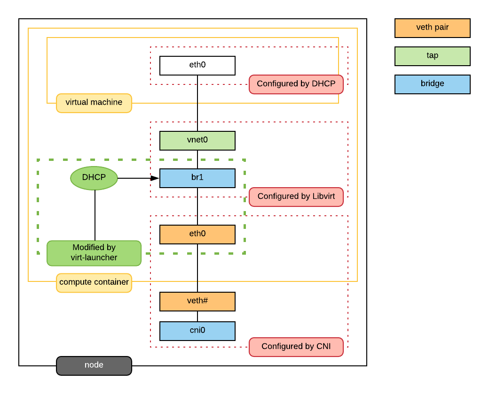

## virt-launcher virtwrap 准备虚拟机的网络

virt-launcher pod 和 虚拟机一一对应，在pod中运行一台虚拟机， virt-launcher pod负责提供运行虚拟机必要的组件。本篇文章是介绍网络相关的组件。下图是KubeVirt的网络。

{ loading=lazy }

!!! info "解释"

    - 三个包含关系的实线框，从外到里分别是：Kubernetes工作节点、工作节点上的POD、POD里运行的VM虚拟机
    - 三个并列的虚线框，从下到上分别是：Kubernetes网络（Kubernetes CNI负责配置），`libvirt`网络，虚拟机网络。本篇不涉及Kubernetes网络，只涉及`libvirt`网络，虚拟机网络

