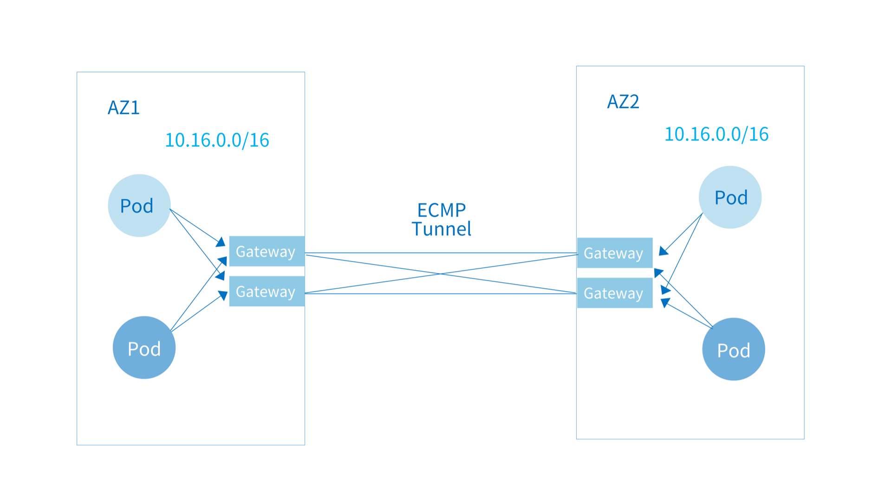

## 使用 OVN-IC 进行多集群互联

Kube-OVN 支持通过 OVN-IC 将两个 Kubernetes 集群 Pod 网络打通，打通后的两个集群内的 Pod 可以通过 Pod IP 进行直接通信。 Kube-OVN 使用隧道对跨集群流量进行封装，两个集群之间只要存在一组 IP 可达的机器即可完成容器网络的互通。

!!! note "备注"

    该模式的多集群互联为 Overlay 网络功能，Underlay 网络如果想要实现集群互联需要底层基础设施做网络打通。

{ loading=lazy }

### 前提条件

1. 自动互联模式下不同集群的子网 CIDR 不能相互重叠，默认子网需在安装时配置为不重叠的网段。若存在重叠需参考后续手动互联过程，只能将不重叠网段打通。
2. 需要存在一组机器可以被每个集群的 `kube-ovn-controller` 通过 IP 访问，用来部署跨集群互联的控制器。
3. 每个集群需要有一组可以通过 IP 进行跨集群互访的机器作为之后的网关节点。
4. 该功能只对默认 VPC 生效，用户自定义 VPC 无法使用互联功能。

### 部署单节点 OVN-IC 数据库

在每个集群 `kube-ovn-controller` 可通过 IP 访问的机器上部署 `OVN-IC` 数据库，该节点将保存各个集群同步上来的网络配置信息。

部署 `docker`/`containerd` 的环境可以使用下面的命令启动 `OVN-IC` 数据库：

=== "docker"

    ```bash
    docker run --name=ovn-ic-db -d --network=host --privileged  -v /etc/ovn/:/etc/ovn -v /var/run/ovn:/var/run/ovn -v /var/log/ovn:/var/log/ovn kubeovn/kube-ovn:v1.12.0 bash start-ic-db.sh
    ```

=== "containerd"

    ```bash
    ctr -n k8s.io run -d --net-host --privileged --mount="type=bind,src=/etc/ovn/,dst=/etc/ovn,options=rbind:rw" --mount="type=bind,src=/var/run/ovn,dst=/var/run/ovn,options=rbind:rw" --mount="type=bind,src=/var/log/ovn,dst=/var/log/ovn,options=rbind:rw" docker.io/kubeovn/kube-ovn:v1.12.0 ovn-ic-db bash start-ic-db.sh
    ```

### 自动路由设置

在自动路由设置下，每个集群会将自己默认 VPC 下 `Subnet` 的 CIDR 信息同步给 `OVN-IC`，因此要确保两个集群的 `Subnet` CIDR 不存在重叠。

在 `kube-system` Namespace 下创建 `ovn-ic-config` ConfigMap：

```yaml linenums="1"
apiVersion: v1
kind: ConfigMap
metadata:
  name: ovn-ic-config
  namespace: kube-system
data:
  enable-ic: "true"
  az-name: "az1" 
  ic-db-host: "192.168.65.3"
  ic-nb-port: "6645" 
  ic-sb-port: "6646"
  gw-nodes: "az1-gw"
  auto-route: "true"
```

| 参数字段         | 描述                                                                                                 |
|:-------------|:---------------------------------------------------------------------------------------------------|
| `enable-ic`  | 是否开启集群互联。                                                                          |
| `az-name` | 区分不同集群的集群名称，每个互联集群需不同。  |
| `ic-db-host`| 部署 `OVN-IC` 数据库的节点地址。|
| `ic-nb-port`| `OVN-IC` 北向数据库端口，默认为 `6645`。|
| `ic-sb-port`| `OVN-IC` 南向数据库端口，默认为 `6646`。|
| `gw-nodes`| 集群互联中承担网关工作的节点名，逗号分隔。|
| `auto-route`| 是否自动对外发布和学习路由。|


!!! warning "注意"

    为了保证操作的正确性，`ovn-ic-config` 这个 ConfigMap 不允许修改。如有参数需要变更，请删除该 ConfigMap，修改后再应用此 ConfigMap。

在 `ovn-ic` 容器内通过下面的命令查看是否已建立互联逻辑交换机 `ts`：

```bash
$ ovn-ic-sbctl show
availability-zone az1
    gateway deee03e0-af16-4f45-91e9-b50c3960f809
        hostname: az1-gw
        type: geneve
            ip: 192.168.42.145
        port ts-az1
            transit switch: ts
            address: ["00:00:00:50:AC:8C 169.254.100.45/24"]
availability-zone az2
    gateway e94cc831-8143-40e3-a478-90352773327b
        hostname: az2-gw
        type: geneve
            ip: 192.168.42.149
        port ts-az2
            transit switch: ts
            address: ["00:00:00:07:4A:59 169.254.100.63/24"]
```

在每个集群观察逻辑路由是否有学习到的对端路由：

```bash
$ kubectl ko nbctl lr-route-list ovn-cluster
IPv4 Routes
                10.42.1.1            169.254.100.45 dst-ip (learned)
                10.42.1.3                100.64.0.2 dst-ip
                10.16.0.2                100.64.0.2 src-ip
                10.16.0.3                100.64.0.2 src-ip
                10.16.0.4                100.64.0.2 src-ip
                10.16.0.6                100.64.0.2 src-ip
             10.17.0.0/16            169.254.100.45 dst-ip (learned)
            100.65.0.0/16            169.254.100.45 dst-ip (learned)
```

接下来可以尝试在集群 1 内的一个 Pod 内直接 `ping` 集群 2 内的一个 Pod IP 观察是否可以联通。

对于某个不想对外自动发布路由的子网可以通过修改 `Subnet` 里的 `disableInterConnection` 来禁止路由广播：

```yaml linenums="1"
apiVersion: kubeovn.io/v1
kind: Subnet
metadata:
  name: no-advertise
spec:
  cidrBlock: 10.199.0.0/16
  disableInterConnection: true
```

### 手动路由设置

对于集群间存在重叠 CIDR 只希望做部分子网打通的情况，可以通过下面的步骤手动发布子网路由。

在 `kube-system` Namespace 下创建 `ovn-ic-config` ConfigMap，并将 `auto-route` 设置为 `false`：

```yaml linenums="1"
apiVersion: v1
kind: ConfigMap
metadata:
  name: ovn-ic-config
  namespace: kube-system
data:
  enable-ic: "true"
  az-name: "az1" 
  ic-db-host: "192.168.65.3"
  ic-nb-port: "6645" 
  ic-sb-port: "6646"
  gw-nodes: "az1-gw"
  auto-route: "false"
```

在每个集群分别查看远端逻辑端口的地址，用于之后手动配置路由：

```bash
[root@az1 ~]# kubectl ko nbctl show
switch a391d3a1-14a0-4841-9836-4bd930c447fb (ts)
    port ts-az1
        type: router
        router-port: az1-ts
    port ts-az2
        type: remote
        addresses: ["00:00:00:4B:E2:9F 169.254.100.31/24"]

[root@az2 ~]# kubectl ko nbctl show
switch da6138b8-de81-4908-abf9-b2224ec4edf3 (ts)
    port ts-az2
        type: router
        router-port: az2-ts
    port ts-az1
        type: remote
        addresses: ["00:00:00:FB:2A:F7 169.254.100.79/24"]   
```

由上输出可知，集群 `az1` 到 集群 `az2` 的远端地址为 `169.254.100.31`，`az2` 到 `az1` 的远端地址为 `169.254.100.79`。

下面手动设置路由，在该例子中，集群 `az1` 内的子网 CIDR 为 `10.16.0.0/24`，集群 `az2` 内的子网 CIDR 为 `10.17.0.0/24`。

在集群 `az1` 设置到集群 `az2` 的路由:

```bash
kubectl ko nbctl lr-route-add ovn-cluster 10.17.0.0/24 169.254.100.31
```

在集群 `az2` 设置到集群 `az1` 的路由:

```bash
kubectl ko nbctl lr-route-add ovn-cluster 10.16.0.0/24 169.254.100.79
```

### 高可用 OVN-IC 数据库部署

`OVN-IC` 数据库之间可以通过 Raft 协议组成一个高可用集群，该部署模式需要至少 3 个节点。

首先在第一个节点上启动 `OVN-IC` 数据库的 leader。

部署 `docker`/`containerd` 环境的用户可以使用下面的命令：

=== "docker"

    ```bash
    docker run --name=ovn-ic-db -d --network=host --privileged -v /etc/ovn/:/etc/ovn -v /var/run/ovn:/var/run/ovn -v /var/log/ovn:/var/log/ovn -e LOCAL_IP="192.168.65.3"  -e NODE_IPS="192.168.65.3,192.168.65.2,192.168.65.1"   kubeovn/kube-ovn:v1.12.0 bash start-ic-db.sh
    ```

=== "containerd"

    ```bash
    ctr -n k8s.io run -d --net-host --privileged --mount="type=bind,src=/etc/ovn/,dst=/etc/ovn,options=rbind:rw" --mount="type=bind,src=/var/run/ovn,dst=/var/run/ovn,options=rbind:rw" --mount="type=bind,src=/var/log/ovn,dst=/var/log/ovn,options=rbind:rw"  --env="NODE_IPS="192.168.65.3,192.168.65.2,192.168.65.1"" --env="LOCAL_IP="192.168.65.3"" docker.io/kubeovn/kube-ovn:v1.12.0 ovn-ic-db bash start-ic-db.sh
    ```

- `LOCAL_IP`： 当前容器所在节点 IP 地址。
- `NODE_IPS`： 运行 `OVN-IC` 数据库的三个节点 IP 地址，使用逗号进行分隔。

接下来，在另外两个节点部署 `OVN-IC` 数据库的 follower。

部署 `docker`/`containerd` 环境的用户可以使用下面的命令：

=== "docker"

    ```bash
    docker run --name=ovn-ic-db -d --network=host --privileged -v /etc/ovn/:/etc/ovn -v /var/run/ovn:/var/run/ovn -v /var/log/ovn:/var/log/ovn -e LOCAL_IP="192.168.65.2"  -e NODE_IPS="192.168.65.3,192.168.65.2,192.168.65.1" -e LEADER_IP="192.168.65.3"  kubeovn/kube-ovn:v1.12.0 bash start-ic-db.sh
    ```

=== "containerd"

    ```bash
    ctr -n k8s.io run -d --net-host --privileged --mount="type=bind,src=/etc/ovn/,dst=/etc/ovn,options=rbind:rw" --mount="type=bind,src=/var/run/ovn,dst=/var/run/ovn,options=rbind:rw" --mount="type=bind,src=/var/log/ovn,dst=/var/log/ovn,options=rbind:rw"  --env="NODE_IPS="192.168.65.3,192.168.65.2,192.168.65.1"" --env="LOCAL_IP="192.168.65.2"" --env="LEADER_IP="192.168.65.3"" docker.io/kubeovn/kube-ovn:v1.12.0 ovn-ic-db bash start-ic-db.sh
    ```

- `LOCAL_IP`： 当前容器所在节点 IP 地址。
- `NODE_IPS`： 运行 `OVN-IC` 数据库的三个节点 IP 地址，使用逗号进行分隔。
- `LEADER_IP`: 运行 `OVN-IC` 数据库 `leader` 节点的 IP 地址。

在每个集群创建 `ovn-ic-config` 时指定多个 `OVN-IC` 数据库节点地址：

```yaml linenums="1"
apiVersion: v1
kind: ConfigMap
metadata:
  name: ovn-ic-config
  namespace: kube-system
data:
  enable-ic: "true"
  az-name: "az1" 
  ic-db-host: "192.168.65.3,192.168.65.2,192.168.65.1"
  ic-nb-port: "6645"
  ic-sb-port: "6646"
  gw-nodes: "az1-gw"
  auto-route: "true"
```

### 手动重置

在一些情况下，由于配置错误需要对整个互联配置进行清理，可以参考下面的步骤清理环境。

删除当前的 `ovn-ic-config` Configmap：

```bash
kubectl -n kube-system delete cm ovn-ic-config
```

删除 `ts` 逻辑交换机：

```bash
kubectl-ko nbctl ls-del ts
```

在对端集群重复同样的步骤。

### 修改 az-name

可以直接通过 `kubectl edit` 的方式对 `ovn-ic-config` 这个 configmap 中的 `az-name` 字段进行修改。 但是需要在每个 ovn-cni pod 上执行以下命令，否则可能出现最长 10 分钟的跨集群网络中断。

```bash
ovn-appctl -t ovn-controller inc-engine/recompute
```

## 使用 Submariner 进行多集群互联

Submariner 作为可以打通多个 Kubernetes 集群 Pod 和 Service 网络的开源网络组件，能够帮助 Kube-OVN 实现多集群互联。

相比通过 `OVN-IC` 打通多集群网络的方式，Submariner 可以打通 Kube-OVN 和非 Kube-OVN 的集群网络，并 能提供 Service 的跨集群能力。但是 Submariner 目前只能实现默认子网的打通，无法实现多子网选择性打通。

### 前提条件

- 两个集群的 Service CIDR 和默认子网的 CIDR 不能重叠。

### 部署 Submariner

下载 `subctl` 二进制文件，并部署到相应路径：

```bash
curl -Ls https://get.submariner.io | bash
export PATH=$PATH:~/.local/bin
echo export PATH=\$PATH:~/.local/bin >> ~/.profile
```

切换 `kubeconfig` 至希望部署 `submariner-broker` 的集群进行部署：

```bash
subctl deploy-broker
```

在本文档中 `cluster0` 的默认子网 CIDR 为 `10.16.0.0/16`，`join` 子网 CIDR 为 `100.64.0.0/16`，`cluster1` 的默认子网 CIDR 为 `11.16.0.0/16`，`join` 子网 CIDR 为 `100.68.0.0/16`。

切换 `kubeconfig` 至 `cluster0` 注册集群至 broker，并注册网关节点:

```bash
subctl  join broker-info.subm --clusterid  cluster0 --clustercidr 100.64.0.0/16,10.16.0.0/16  --natt=false --cable-driver vxlan --health-check=false
kubectl label nodes cluster0 submariner.io/gateway=true
```

切换 `kubeconfig` 至 `cluster1` 注册集群至 broker，并注册网关节点:

```bash
subctl  join broker-info.subm --clusterid  cluster1 --clustercidr 100.68.0.0/16,11.16.0.0/16  --natt=false --cable-driver vxlan --health-check=false
kubectl label nodes cluster1 submariner.io/gateway=true
```

如果执行`join`命令之后没有新的gateway, `routeagentpod` 出现的话, 请为`submariner-operator`这个`clusterrole`增加以下权限:

```yaml
- apiGroups:
  - "apps"
  resources:
  - daemonsets
  verbs:
  - create
  - get
  - list
  - watch
  - update
```

对于多节点的集群，需要将默认的`subnet ovn-default`的网关配置改为`centralized`。为 submariner 配置的gateway节点需要和`subnet`节点完全相同。

接下来可以在两个集群内分别启动 Pod 并尝试使用 IP 进行相互访问。

如果出现网络互通问题可通过 `subctl` 命令进行诊断：

```bash
subctl show all
subctl diagnose all
```