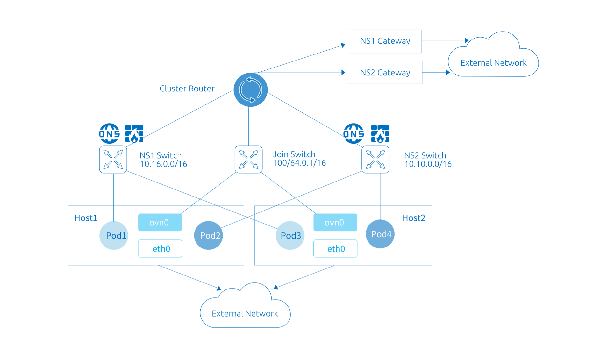
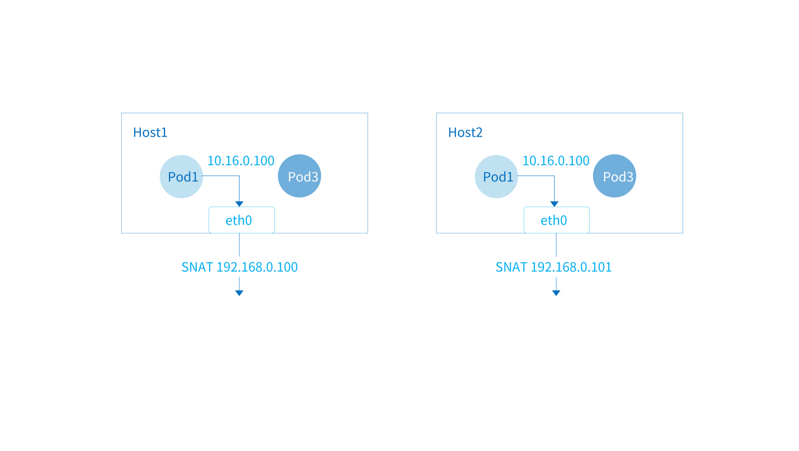

!!! info "子网"

    子网是 Kube-OVN 中的一个核心概念和基本使用单元，Kube-OVN 会以子网来组织 IP 和网络配置，每个 Namespace 可以归属于特定的子网， Namespace 下的 Pod 会自动从所属的子网中获取 IP 并共享子网的网络配置（CIDR，网关类型，访问控制，NAT 控制等）。

和其他 CNI 的每个节点绑定一个子网的实现不同，在 Kube-OVN 中子网为一个全局的虚拟网络配置，同一个子网的地址可以分布在任意一个节点上。

{ loading=lazy }

## 默认子网

为了方便用户的快速上手使用，Kube-OVN 内置了一个默认子网，所有未显式声明子网归属的 Namespace 会自动从默认子网中分配 IP， 并使用默认子网的网络信息。该子网的配置为安装时指定，可以参考内置网络设置， 如果要在安装后修改默认网络的 CIDR 请参考修改默认网络。

在 Overlay 模式下，默认子网使用了分布式网关并对出网流量进行 NAT 转换，其行为和 Flannel 的默认行为基本一致， 用户无需额外的配置即可使用到大部分的网络功能。

在 Underlay 模式下，默认子网使用物理网关作为出网网关，并开启 `arping` 检查网络连通性。

### 查看默认子网

默认子网 `spec` 中的 `default` 字段为 `true`，一个集群下只有一个默认子网，默认名为 ovn-default。

查看默认子网：

```bash
$ kubectl get subnet ovn-default -o yaml
apiVersion: kubeovn.io/v1
kind: Subnet
metadata:
  creationTimestamp: "2019-08-06T09:33:43Z"
  generation: 1
  name: ovn-default
  resourceVersion: "1571334"
  selfLink: /apis/kubeovn.io/v1/subnets/ovn-default
  uid: 7e2451f8-fb44-4f7f-b3e0-cfd27f6fd5d6
spec:
  cidrBlock: 10.16.0.0/16
  default: true
  excludeIps:
  - 10.16.0.1
  gateway: 10.16.0.1
  gatewayType: distributed
  natOutgoing: true
  private: false
  protocol: IPv4
```

### 修改子网 CIDR

!!! warning "注意"

    修改子网 CIDR 后之前创建的 Pod 将无法正常访问网络需要进行重建。 建议操作前慎重考虑。本文只针对业务子网 CIDR 更改进行操作，如需 更改 Join 子网 CIDR 请参考更改 Join 子网 CIDR。

#### 编辑子网

使用 `kubectl edit` 修改子网 `cidrBlock`，`gateway` 和 `excludeIps`。

```bash
kubectl edit subnet test-subnet
```

#### 重建该子网绑定的 Namespace 下所有 Pod

以子网绑定 `test` Namespace 为例：
```bash
for pod in $(kubectl get pod --no-headers -n "$ns" --field-selector spec.restartPolicy=Always -o custom-columns=NAME:.metadata.name,HOST:spec.hostNetwork | awk '{if ($2!="true") print $1}'); do
  kubectl delete pod "$pod" -n test --ignore-not-found
done
```

若只使用了默认子网，可以使用下列命令删除所有非 host 网络模式的 Pod：

```bash
for ns in $(kubectl get ns --no-headers -o custom-columns=NAME:.metadata.name); do
  for pod in $(kubectl get pod --no-headers -n "$ns" --field-selector spec.restartPolicy=Always -o custom-columns=NAME:.metadata.name,HOST:spec.hostNetwork | awk '{if ($2!="true") print $1}'); do
    kubectl delete pod "$pod" -n "$ns" --ignore-not-found
  done
done
```

#### 更改默认子网配置

若修改的为默认子网的 CIDR 还需要更改 `kube-ovn-controller` Deployment 的启动参数：

```yaml
args:
- --default-cidr=10.17.0.0/16
- --default-gateway=10.17.0.1
- --default-exclude-ips=10.17.0.1
```
## Join 子网

在 Kubernetes 的网络规范中，要求 Node 可以和所有的 Pod 直接通信。 为了在 Overlay 网络模式下达到这个目的， Kube-OVN 创建了一个 `join` 子网， 并在每个 Node 节点创建了一块虚拟网卡 ovn0 接入 join 子网，通过该网络完成节点和 Pod 之间的网络互通。

该子网的配置为安装时指定，可以参考内置网络设置，如果要在安装后修改。 `join` 子网的 CIDR 请参考修改 Join 子网

### 查看 Join 子网

该子网默认名为 `join` 一般无需对该子网 CIDR 外的其他网络配置进行修改。

```bash
$ kubectl get subnet join -o yaml
apiVersion: kubeovn.io/v1
kind: Subnet
metadata:
  creationTimestamp: "2019-08-06T09:33:43Z"
  generation: 1
  name: join
  resourceVersion: "1571333"
  selfLink: /apis/kubeovn.io/v1/subnets/join
  uid: 9c744810-c678-4d50-8a7d-b8ec12ef91b8
spec:
  cidrBlock: 100.64.0.0/16
  default: false
  excludeIps:
  - 100.64.0.1
  gateway: 100.64.0.1
  gatewayNode: ""
  gatewayType: ""
  natOutgoing: false
  private: false
  protocol: IPv4
```
在 node 节点查看 `ovn0` 网卡：

```bash
$ **ifconfig ovn0
ovn0: flags=4163<UP,BROADCAST,RUNNING,MULTICAST>  mtu 1420
        inet 100.64.0.4  netmask 255.255.0.0  broadcast 100.64.255.255
        inet6 fe80::800:ff:fe40:5  prefixlen 64  scopeid 0x20<link>
        ether 0a:00:00:40:00:05  txqueuelen 1000  (Ethernet)
        RX packets 18  bytes 1428 (1.3 KiB)
        RX errors 0  dropped 0  overruns 0  frame 0
        TX packets 19  bytes 1810 (1.7 KiB)
        TX errors 0  dropped 0 overruns 0  carrier 0  collisions 0**
```

### 修改 Join 子网 CIDR

!!! warning "注意"

    修改 Join 子网 CIDR 后之前创建的 Pod 将无法正常访问外部网络，需要等重建完成, 建议前操作时慎重考虑。

#### 删除 Join 子网

```bash
kubectl patch subnet join --type='json' -p '[{"op": "replace", "path": "/metadata/finalizers", "value": []}]'
kubectl delete subnet join
```

#### 清理相关分配信息

```bash
kubectl annotate node ovn.kubernetes.io/allocated=false --all --overwrite
```

#### 修改 Join 子网相关信息

修改 `kube-ovn-controller` 内 Join 子网相关信息：

```bash
kubectl edit deployment -n kube-system kube-ovn-controller
```

修改下列参数:

```yaml
args:
- --node-switch-cidr=100.51.0.0/16
```

重启 `kube-ovn-controller` 重建 `join` 子网：

```bash
kubectl delete pod -n kube-system -lapp=kube-ovn-controller
```

查看新的 Join 子网信息：

```bash
$ kubectl get subnet
NAME          PROVIDER   VPC           PROTOCOL   CIDR            PRIVATE   NAT     DEFAULT   GATEWAYTYPE   V4USED   V4AVAILABLE   V6USED   V6AVAILABLE   EXCLUDEIPS
join          ovn        ovn-cluster   IPv4       100.51.0.0/16   false     false   false     distributed   2        65531         0        0             ["100.51.0.1"]
ovn-default   ovn        ovn-cluster   IPv4       10.17.0.0/16    false     true    true      distributed   5        65528         0        0             ["10.17.0.1"]
```

#### 重新配置 ovn0 网卡地址

每个节点的 `ovn0` 网卡信息需要重新更新，可通过重启 `kube-ovn-cni` 来完成：

```bash
kubectl delete pod -n kube-system -l app=kube-ovn-cni
```

## 创建自定义子网

### 创建子网

```bash
cat <<EOF | kubectl create -f -
apiVersion: kubeovn.io/v1
kind: Subnet
metadata:
  name: subnet1
spec:
  protocol: IPv4
  cidrBlock: 10.66.0.0/16
  excludeIps:
  - 10.66.0.1..10.66.0.10
  - 10.66.0.101..10.66.0.151
  gateway: 10.66.0.1
  gatewayType: distributed
  natOutgoing: true
  routeTable: ""
  namespaces:
  - ns1
  - ns2
EOF
```

部分`subnetSpec`参数描述如下：

### 验证子网绑定生效

```bash
$ kubectl create ns ns1
namespace/ns1 created

$ kubectl run nginx --image=docker.io/library/nginx:alpine -n ns1
deployment.apps/nginx created

$ kubectl get pod -n ns1 -o wide
NAME                     READY   STATUS    RESTARTS   AGE   IP           NODE    NOMINATED NODE   READINESS GATES
nginx-74d5899f46-n8wtg   1/1     Running   0          10s   10.66.0.11   node1   <none>           <none>
```

## Overlay 子网网关

!!! warning "注意"

    该功能只对 Overlay 模式子网生效，Underlay 类型子网访问外部网络需要借助底层物理网关。

Overlay 子网下的 Pod 需要通过网关来访问集群外部网络，Kube-OVN 目前支持两种类型的网关： 分布式网关和集中式网关，用户可以在子网中对网关的类型进行调整。

两种类型网关均支持 `natOutgoing` 设置，用户可以选择 Pod 访问外网时是否需要进行 snat。

### 分布式网关

子网的默认类型网关，每个 node 会作为当前 node 上 pod 访问外部网络的网关。 数据包会通过本机的 `ovn0` 网卡流入主机网络栈，再根据主机的路由规则进行出网。 当 `natOutgoing` 为 `true` 时，Pod 访问外部网络将会使用当前所在宿主机的 IP。

{ loading=lazy }

子网示例，其中 `gatewayType` 字段为 `distributed`：

```yaml linenums="1"
apiVersion: kubeovn.io/v1
kind: Subnet
metadata:
  name: distributed
spec:
  protocol: IPv4
  cidrBlock: 10.166.0.0/16
  default: false
  excludeIps:
  - 10.166.0.1
  gateway: 10.166.0.1
  gatewayType: distributed
  natOutgoing: true
```
