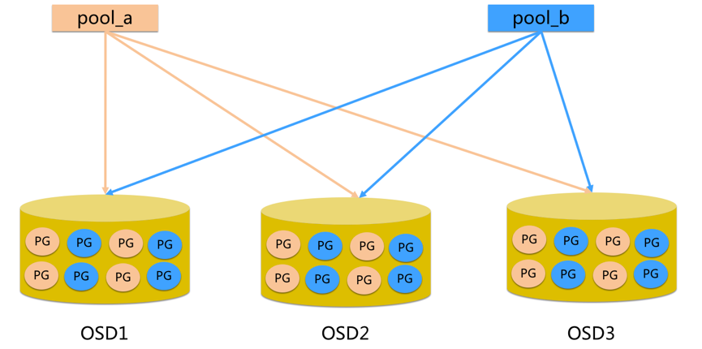

Ceph 是一个统一的分布式存储系统，提供较好的性能、可靠性和可扩展性。最早起源于 Sage 博士期间的工作，随后贡献给开源社区。

## 简介

**高性能**

- 抛弃了传统的集中式存储运输局寻址的方案，采用 CRUSH 算法，数据分布均衡，并行度高。
- 考虑了容灾域的隔离，能够实现各类负载的副本设置规则，例如跨机房、机架感知等。
- 能够支持上千个存储节点的规模，支持 TB 到 PB 级的数据。

**高可用性**

- 副本数可以灵活控制
- 支持故障域分离，数据强一致性
- 多种故障场景自动进行修复自愈
- 没有单点故障，自动管理

**高可扩展性**

- 去中心化
- 扩展灵活
- 随着节点增加而线性增长

**特性丰富**

- 支持三种存储接口：块存储、文件存储、对象存储
- 支持自定义接口，支持多种语言驱动

## 架构

支持三种接口

- `Object`：有原生 API，而且也兼容 Swift 和 S3 的 API
- `Block`：支持精简配置、快照、克隆
- `File`：Posix 接口，支持快照

{ loading=lazy }

## 组件

|           组件            | 描述                                                                                                                      |
|:-----------------------:|:------------------------------------------------------------------------------------------------------------------------|
|        `Monitor`        | 一个 Ceph 集群需要多个 `Monitor` 组成的小集群，它们通过 Paxos 同步数据，用来保存 OSD 的元数据。 |
|          `OSD`          | `Object Storage Device`，也就是负责响应客户端请求返回具体数据的进程，一个 Ceph 集群一般都有很多个 OSD。主要功能用于数据的存储，当直接使用硬盘作为存储目标时，一块硬盘称之为 `OSD`，当使用一个目录作为存储目标的时候，这个目录也被称为 OSD。 |
|          `MDS`          | `Ceph Metadata Server`，是 CephFS 服务依赖的元数据服务，对象存储和块设备存储不需要该服务。                                               |
|        `Object`         | Ceph 最底层的存储单元是 `Object` 对象，一条数据、一个配置都是一个对象，每个 Object 包含 ID、元数据和原始数据。                            |
|         `Pool`          | `Pool` 是一个存储对象的逻辑分区，它通常规定了数据冗余的类型与副本数，默认为3副本。对于不同类型的存储，需要单独的 Pool，如 RBD。|
|          `PG`           | 全称 `Placement Groups`，是一个逻辑概念，一个 `OSD` 包含多个 `PG`。引入 PG 这一层其实是为了更好的分配数据和定位数据。每个 Pool 内包含很多个 `PG`，它是一个对象的集合，服务端数据均衡和恢复的最小单位就是 PG。|
| `FileStore`与`BlueStore` | `FileStore` 是老版本默认使用的后端存储引擎，如果使用 `FileStore`，建议使用 xfs 文件系统。`BlueStore` 是一个新的后端存储引擎，可以直接管理裸硬盘，抛弃了 ext4 与 xfs 等本地文件系统。可以直接对物理硬盘进行操作，同时效率也高出很多。|
|         `Rados`         | 全称 `Reliable Autonomic Distributed Object Store`，是 Ceph 集群的精华，用于实现数据分配、Failover 等集群操作。|
|       `Librados`        | `Librados` 是 `Rados` 提供库，因为 `RADOS` 是协议很难直接访问，因此上层的 `RBD`、`RGW` 和 `CephFS` 都是通过 librados 访问的，目前提供 PHP、Ruby、Java、Python、C 和 C++ 支持。|
|         `CRUSH`         | `CRUSH` 是 Ceph 使用的数据分布算法，类似一致性哈希，让数据分配到预期的地方。|
|          `RBD`          | 全称 `RADOS Block Device`，是 Ceph 对外提供的块设备服务，如虚拟机硬盘，支持快照功能。|
|          `RGW`          | 全称是 `RADOS Gateway`，是 Ceph 对外提供的对象存储服务，接口与 S3 和 Swift 兼容。|
|         `CephFS`          | 全称 `Ceph File System`，是 Ceph 对外提供的文件系统服务。|

{ loading=lazy }

- pool 是 ceph 存储数据时的逻辑分区，它起到 namespace 的作用
- 每个 pool 包含一定数量(可配置)的 PG
- PG 里的对象被映射到不同的 Object 上
- pool 是分布到整个集群的

