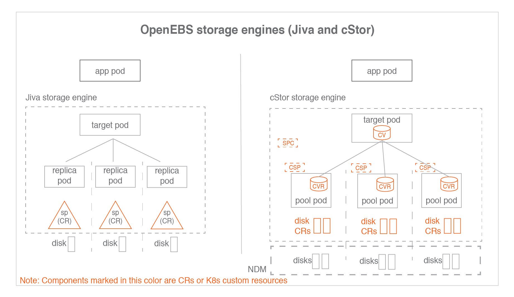

## 存储引擎概述

存储引擎是持久化卷`IO`路径的数据平面组件。 在CAS架构中，用户可以根据不同的配置策略，为不同的应用工作负载选择不同的数据平面。 存储引擎可以通过特性集或性能优化给定的工作负载。

操作员或管理员通常选择具有特定软件版本的存储引擎，并构建优化的卷模板， 这些卷模板根据底层磁盘的类型、弹性、副本数量和参与Kubernetes集群的节点集进行微调。 用户可以在发放卷时选择最优的卷模板，从而在给定的Kubernetes集群上为所有存储卷运行最优的软件和存储组合提供最大的灵活性。

## 存储引擎类型

OpenEBS提供了三种存储引擎

### Jiva

`Jiva`是OpenEBS 0.1版中发布的第一个存储引擎，使用起来最简单。它基于GoLang开发，内部使用`LongHorn`和`gotgt`堆栈。 `Jiva`完全在用户空间中运行，并提供同步复制等标准块存储功能。 `Jiva`通常适用于容量较小的工作负载，不适用于大量快照和克隆特性是主要需求的情况

### cStor

`cStor`是OpenEBS 0.7版本中最新发布的存储引擎。`cStor`非常健壮，提供数据一致性，很好地支持快照和克隆等企业存储特性。 它还提供了一个健壮的存储池特性，用于在容量和性能方面进行全面的存储管理。 `cStor`与`NDM` (Node Disk Manager)一起，为Kubernetes上的有状态应用程序提供完整的持久化存储特性

### OpenEBS Local PV

`OpenEBS Local PV`是一个新的存储引擎，它可以从本地磁盘或工作节点上的主机路径创建持久卷或PV。 CAS引擎可以从OpenEBS的`1.0.0`版本中获得。使用`OpenEBS Local PV`，性能将等同于创建卷的本地磁盘或文件系统(主机路径)。 许多云原生应用程序可能不需要复制、快照或克隆等高级存储特性，因为它们本身就提供了这些特性。这类应用程序需要以持久卷的形式访问管理的磁盘

{ loading=lazy }

- `SP`: 存储池，表示Jiva自定义存储资源
- `CV`: `cStor`卷，表示cStor卷自定义资源
- `CVR`：`cStor`卷副本
- `SPC`：存储池声明，表示cStor池聚合的自定义资源
- `CSP`: `cStor`存储池，表示`cStor` Pool每个节点上的自定义资源

一个`SPC`对应多个`CSP`，相应的一个`CV`对应多个`CVR`。

## 存储引擎声明

通过指定注释openebs来选择存储引擎。 `StorageClass`规范中的`io/cas-type`。`StorageClass`定义了提供程序的细节。为每个CAS引擎指定单独的供应程序。

=== "cStor"

    ```yaml linenums="1" title="cStor存储类规范文件内容"
    ---
    apiVersion: storage.k8s.io/v1
    kind: StorageClass
    metadata:
      name: cStor-storageclass
      annotations:
        openebs.io/cas-type: cstor
        cas.openebs.io/config: |
          - name: StoragePoolClaim
            value: "cStorPool-SSD"
    provisioner: openebs.io/provisioner-iscsi
    ---
    ```

=== "Jiva"

    ```yaml linenums="1" title="Jiva存储类规范文件内容"
    ---
    apiVersion: storage.k8s.io/v1
    kind: StorageClass
    metadata:
      name: jiva-storageclass
      annotations:
        openebs.io/cas-type: jiva
        cas.openebs.io/config: |
          - name: StoragePool
            value: default
    provisioner: openebs.io/provisioner-iscsi
    ---
    ```
    
    当cas类型为`Jiva`时，`StoragePool`的`default`值具有特殊含义。 当`pool`为默认值时，`Jiva`引擎将从容器(副本pod)本身的存储空间中为副本pod开辟数据存储空间。 当所需的卷大小很小(比如`5G`到`10G`)时，`StoragePool default`工作得很好，因为它可以容纳在容器本身内。

=== "Local PV HostPath"

    ```yaml linenums="1" title="Local PV存储类规范文件内容-主机路径"
    ---
    apiVersion: storage.k8s.io/v1
    kind: StorageClass
    metadata:
      name: localpv-hostpath-sc
      annotations:
        openebs.io/cas-type: local
        cas.openebs.io/config: |
          - name: BasePath
            value: "/var/openebs/local"
          - name: StorageType
            value: "hostpath"
    provisioner: openebs.io/local
    ---
    ```

=== "Local PV Device"

    ```yaml linenums="1" title="Local PV存储类规范文件内容-主机设备"
    ---
    apiVersion: storage.k8s.io/v1
    kind: StorageClass
    metadata:
      name: localpv-device-sc
      annotations:
        openebs.io/cas-type: local
        cas.openebs.io/config: |
          - name: StorageType
            value: "device"
          - name: FSType
            value: ext4
    provisioner: openebs.io/local
    ---
    ```

`cStor`、`Jiva`、`Local PV`特性比较：

| 特性           | `Jiva` | `cStor`  | `Local PV` |
|:-------------|:-------|:---------|:-----------|
| 轻量级运行于用户空间   | Yes    | Yes      | Yes        | 
| 同步复制         | Yes    | Yes      | No         |
| 适合低容量工作负载    | Yes    | Yes      | Yes        |
| 支持快照，克隆	     | Basic  | Advanced | No         |
| 数据一致性        | Yes    | Yes      | NA         |
| 使用Velero恢复备份 | Yes    | Yes      | Yes        |
| 适合高容量工作负载    | No     | Yes      | Yes        |
| 自动精简配置       |        | Yes      | No         |
| 磁盘池或聚合支持     |        | Yes      | No         |
| 动态扩容         |        | Yes      | Yes        |
| 数据弹性(RAID支持) |        | Yes      | No         |
| 接近原生磁盘性能     | No     | No       | Yes        | 


大多数场景推荐`cStor`，因其提供了强大的功能，包括快照/克隆、存储池功能（如精简资源调配、按需扩容等）。

`Jiva`适用于低容量需求的工作负载场景，例如`5`到`50G`。 尽管使用`Jiva`没有空间限制，但建议将其用于低容量工作负载。 `Jiva`非常易于使用，并提供企业级容器本地存储，而不需要专用硬盘。 有快照和克隆功能的需求的场景，优先考虑使用`cStor`而不是`Jiva`。

## CAS引擎使用场景

如上表所示，每个存储引擎都有自己的优势。 选择引擎完全取决于应用程序的工作负载以及它当前和未来的容量和/或性能增长。 下面的指导原则在定义存储类时为选择特定的引擎提供一些帮助。

选择各个存储引擎的理想条件如下：

=== "cStor"

    - 当需要同步复制数据并在节点上有多个磁盘时
    - 当您从每个节点上的本地磁盘或网络磁盘池管理多个应用程序的存储时。 通过精简配置、存储池和卷的按需扩容、存储池的性能按需扩容等特性，实现对存储层的管理。 `cStor`用于在本地运行的Kubernetes集群上构建Kubernetes本地存储服务，类似于`AWS EBS`或谷歌`PD`。
    - 当需要存储级快照和克隆能力时
    - 当您需要企业级存储保护特性，如数据一致性、弹性(RAID保护)。
    - 如果您的应用程序不需要存储级复制，那么使用OpenEBS主机路径`Local PV`或OpenEBS设备`Local PV`可能是更好的选择。

=== "Jiva"

    - 当您想要数据的同步复制，并且拥有单个本地磁盘或单个管理磁盘(如云磁盘(`EBS`、`GPD`))，并且不需要快照或克隆特性时
    - `Jiva`是最容易管理的，因为磁盘管理或池管理不在这个引擎的范围内。`Jiva`池是本地磁盘、网络磁盘、虚拟磁盘或云磁盘的挂载路径。
    - 以下场景`Jiva`更优于`cStor`:
         - 当程序不需要存储级的快照、克隆特性
         - 当节点上没有空闲磁盘时。`Jiva`可以在主机目录上使用，并且仍然可以实现复制。
         - 当不需要动态扩展本地磁盘上的存储时。将更多磁盘添加到`Jiva`池是不可能的，因此`Jiva`池的大小是固定的，如果它在物理磁盘上。 但是，如果底层磁盘是虚拟磁盘、网络磁盘或云磁盘，则可以动态地更改`Jiva`池的大小
         - 容量需求较小。大容量应用通常需要动态增加容量，`cStor`更适合这种需求

=== "Local PV HostPath"

    - 当应用程序本身具备管理复制能力（例如：es）时，不需要在存储层进行复制。在大多数这样的情况下，应用程序是作为statefulset部署的
    - 高于`Jiva`与`cStor`的读写性能需求
    - 当特定应用程序没有专用的本地磁盘或特定应用程序不需要专用的存储时，建议使用`HostPath`。 如果您想跨多个应用程序共享一个本地磁盘，主机路径`Local PV`是正确的方法

=== "Local PV Device"

    - 当应用程序管理复制本身，不需要在存储层进行复制时。在大多数这种情况下，应用程序被部署为有状态集
    - 高于`Jiva`与`cStor`的读写性能需求
    - 高于OpenEBS主机路径`Local PV`的读写性能需求
    - 当需要接近磁盘性能时。该卷专用于写入单个`SSD`或`NVMe`接口以获得最高性能

### 总结

- 如果应用程序处于生产中，并且不需要存储级复制，那么首选`Local PV`
- 如果您的应用程序处于生产状态，并且需要存储级复制，那么首选`cStor`
- 如果应用程序较小，需要存储级复制，但不需要快照或克隆，则首选`Jiva`