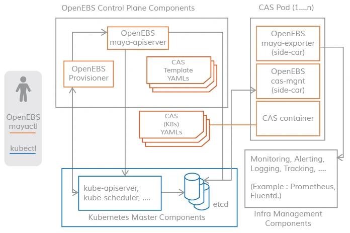

## 组件概述

OpenEBS 集群的控制平面通常被称为 Maya，控制平面负责供应卷、相关的卷操作，如快照、制作克隆、创建存储策略、执行存储策略、导出卷指标供 Prometheus/grafana 消费等。

OpenEBS 控制平面 Maya 实现了创建超融合的 OpenEBS，并将其挂载到如 Kubernetes 调度引擎上，用来扩展特定的容器编排系统提供的存储功能；OpenEBS 的控制平面也是基于微服务的，通过不同的组件实现存储管理功能、监控、容器编排插件等功能。

{ loading=lazy }

OpenEBS 提供了一个动态供应器，它是标准的 Kubernetes 外部存储插件。OpenEBS PV 供应器的主要任务是向应用 Pod 发起卷供应，并实现Kubernetes 的 PV 规范。

`maya-apiserver` 暴露了存储 REST API，并承担了大部分的卷策略处理和管理。

控制平面和数据平面之间的连接采用 Kubernetes sidecar 模式。有如下几个场景，控制平面需要与数据平面进行通信。

- 对于 IOPS、吞吐量、延迟等卷统计 - 通过 `volume-exporter` sidecar实现
- 用于通过卷控制器 Pod 执行卷策略，以及通过卷复制 Pod 进行磁盘/池管理 - 通过卷管理 sidecar 实现。

下面对上述控制平面的组成进行详细说明。

## OpenEBS PV Provisioner

