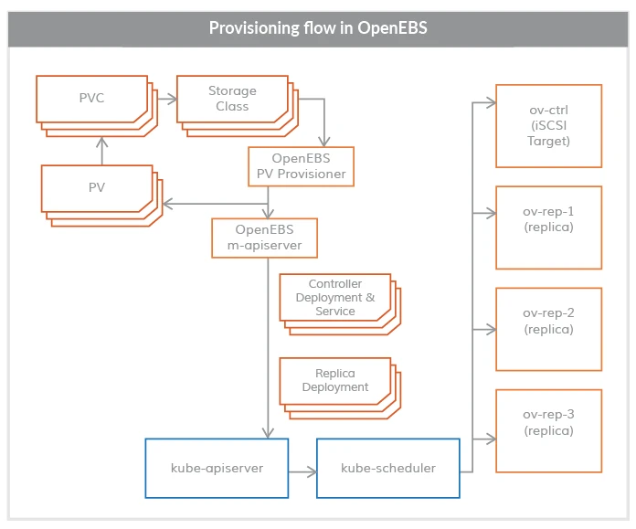
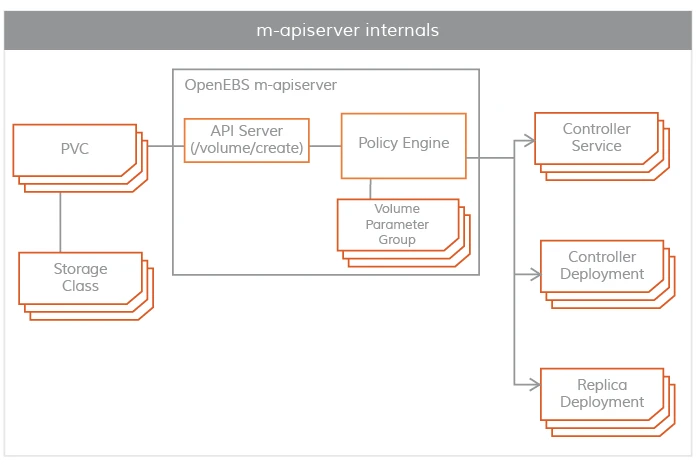
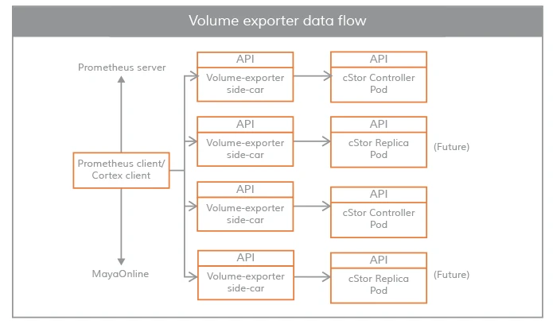
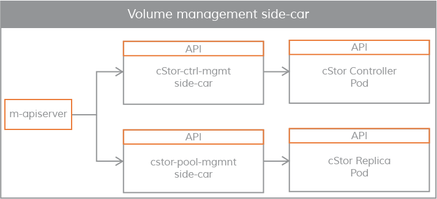

## 组件概述

OpenEBS 集群的控制平面通常被称为 Maya，控制平面负责供应卷、相关的卷操作，如快照、制作克隆、创建存储策略、执行存储策略、导出卷指标供 Prometheus/grafana 消费等。

OpenEBS 控制平面 Maya 实现了创建超融合的 OpenEBS，并将其挂载到如 Kubernetes 调度引擎上，用来扩展特定的容器编排系统提供的存储功能；OpenEBS 的控制平面也是基于微服务的，通过不同的组件实现存储管理功能、监控、容器编排插件等功能。

{ loading=lazy }

OpenEBS 提供了一个动态供应器，它是标准的 Kubernetes 外部存储插件。OpenEBS PV 供应器的主要任务是向应用 Pod 发起卷供应，并实现Kubernetes 的 PV 规范。

`maya-apiserver` 暴露了存储 REST API，并承担了大部分的卷策略处理和管理。

控制平面和数据平面之间的连接采用 Kubernetes sidecar 模式。有如下几个场景，控制平面需要与数据平面进行通信。

- 对于 IOPS、吞吐量、延迟等卷统计 - 通过 `volume-exporter` sidecar实现
- 用于通过卷控制器 Pod 执行卷策略，以及通过卷复制 Pod 进行磁盘/池管理 - 通过卷管理 sidecar 实现。

下面对上述控制平面的组成进行详细说明。

## OpenEBS PV Provisioner

{ loading=lazy }

该组件作为一个 Pod 运行，并做出供应决策。它的使用方式是开发者用所需的卷参数构建一个请求，选择合适的存储类，并在 YAML 规范上调用 kubelet。OpenEBS PV 动态供应器与`maya-apiserver` 交互，在适当的节点上为卷控制器 Pod 和卷复制 Pod 创建部署规范。可以使用 PVC 规范中的注解来控制容量 Pod（控制器/副本）的调度。

目前，OpenEBS 供应器只支持一种类型的绑定，即 `iSCSI`。

## Maya-ApiServer

{ loading=lazy }

`maya-apiserver` 作为一个 Pod 运行，主要是用来暴露 OpenEBS REST APIs。

`maya-apiserver` 还负责创建创建卷 Pod 所需的部署规范文件，在生成这些规范文件后，它调用 kube-apiserver 来相应地调度Pods。在 OpenEBS PV 供应器的卷供应结束时，会创建一个Kubernetes 对象 PV，并挂载在应用 Pod 上，PV由控制器 Pod 托管，控制器 Pod 由一组位于不同节点的副本 Pod 支持，控制器 Pod和副本 Pod 是数据平面的一部分，。

`maya-apiserver` 的另一个重要任务是卷策略管理。OpenEBS 提供了非常细化的规范来表达策略，m-apiserver 解释这些 YAML 规范，将其转换为可执行的组件，并通过卷管理 sidecar 来执行。

## Maya Volume Exporter

{ loading=lazy }

`Maya Volume Exporter` 是每个存储控制器 Pod（cStor/Jiva）的 sidecar。这些 sidecars 将控制平面与数据平面连接起来，以获取统计数据，比如：

- volume 读/写延迟
- 读/写 IOPS
- 读/写块大小
- 容量统计
- `OpenEBS volume exporter` 数据流

## Volume 管理 Sidecars

Sidecars 还用于将控制器配置参数和卷策略传递给作为数据平面的卷控制器 Pod，以及将副本配置参数和副本数据保护参数传递给卷副本 Pod。

{ loading=lazy }
