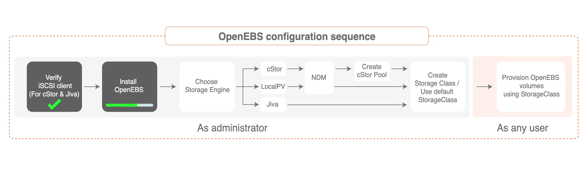

## 安装

由于 OpenEBS 通过 iSCSI 协议提供存储支持，因此，需要在所有 Kubernetes 节点上都安装 iSCSI 客户端（启动器）。

比如我们这里使用的是 CentOS 的系统，执行下面的命令安装启动 iSCSI 启动器：

```bash linenums="1"
# 安装 iscsi
$ yum install iscsi-initiator-utils -y

# 查看 InitiatorName 是否正常配置
$ cat /etc/iscsi/initiatorname.iscsi

# 启动查看状态
$ systemctl enable --now iscsid
$ systemctl start iscsid.service
$ systemctl status iscsid.service
```

iSCSI 客户端启动完成后就可以开始安装 OpenEBS 了。

{ loading=lazy }

直接使用下面的命令安装 OpenEBS 即可：

```bash
$ kubectl apply -f https://openebs.github.io/charts/openebs-operator.yaml
```

该命令会将应用安装到名为 openebs 的命名空间中，安装成功后正常可以看到如下所示的 Pod：

```bash
$ kubectl get pods -n openebs                               
NAME                                           READY   STATUS    RESTARTS   AGE
maya-apiserver-5db4c7f9bc-fv9sc                1/1     Running   0          19h
openebs-admission-server-6c64d9ff64-sklvp      1/1     Running   0          19h
openebs-localpv-provisioner-784d8f9b56-9mphk   1/1     Running   1          19h
openebs-ndm-fdlpx                              1/1     Running   0          19h
openebs-ndm-jfxbj                              1/1     Running   0          19h
openebs-ndm-operator-6d5978d6fb-swp65          1/1     Running   0          19h
openebs-provisioner-7b99c87dbf-zpxqn           1/1     Running   1          19h
openebs-snapshot-operator-69b9f8cd8b-r6hrn     2/2     Running   1          19h
```

默认情况下 OpenEBS 还会安装一些内置的 StorageClass 对象：

```bash
$ kubectl get sc
NAME                        PROVISIONER                                                RECLAIMPOLICY   VOLUMEBINDINGMODE      ALLOWVOLUMEEXPANSION   AGE
openebs-device              openebs.io/local                                           Delete          WaitForFirstConsumer   false                  19h
openebs-hostpath            openebs.io/local                                           Delete          WaitForFirstConsumer   false                  19h
openebs-jiva-default        openebs.io/provisioner-iscsi                               Delete          Immediate              false                  19h
openebs-snapshot-promoter   volumesnapshot.external-storage.k8s.io/snapshot-promoter   Delete          Immediate              false                  19h
```

## 测试

接下来我们创建一个 PVC 资源对象，Pods 使用这个 PVC 就可以从 OpenEBS 动态 Local PV Provisioner 中请求 Hostpath Local PV 了。

直接使用上面自带的 `openebs-hostpath` 这个 StorageClass 来创建 PVC：

```yaml linenums="1" title="local-hostpath-pvc.yaml"
apiVersion: v1
kind: PersistentVolumeClaim
metadata:
  name: local-hostpath-pvc
spec:
  storageClassName: openebs-hostpath
  accessModes:
    - ReadWriteOnce
  resources:
    requests:
      storage: 5Gi
```

直接创建这个 PVC 即可：

```bash
$ kubectl apply -f local-hostpath-pvc.yaml
$ kubectl get pvc local-hostpath-pvc
NAME                 STATUS    VOLUME   CAPACITY   ACCESS MODES   STORAGECLASS       AGE
local-hostpath-pvc   Pending                                      openebs-hostpath   12s
```

我们可以看到这个 PVC 的状态是 `Pending`，这是因为对应的 StorageClass 是延迟绑定模式，所以需要等到 Pod 消费这个 PVC 后才会去绑定，接下来我们去创建一个 Pod 来使用这个 PVC。

声明一个如下所示的 Pod 资源清单：

```yaml linenums="1" title="local-hostpath-pod.yaml"
apiVersion: v1
kind: Pod
metadata:
  name: hello-local-hostpath-pod
spec:
  volumes:
  - name: local-storage
    persistentVolumeClaim:
      claimName: local-hostpath-pvc
  containers:
  - name: hello-container
    image: busybox
    command:
       - sh
       - -c
       - 'while true; do echo "`date` [`hostname`] Hello from OpenEBS Local PV." >> /mnt/store/greet.txt; sleep $(($RANDOM % 5 + 300)); done'
    volumeMounts:
    - mountPath: /mnt/store
      name: local-storage
```

直接创建这个 Pod：

```bash
$ kubectl apply -f local-hostpath-pod.yaml
$ kubectl get pods hello-local-hostpath-pod          
NAME                       READY   STATUS    RESTARTS   AGE
hello-local-hostpath-pod   1/1     Running   0          2m7s
$ kubectl get pvc local-hostpath-pvc           
NAME                 STATUS   VOLUME                                     CAPACITY   ACCESS MODES   STORAGECLASS       AGE
local-hostpath-pvc   Bound    pvc-3f4a1a65-6cbc-42bf-a1f8-87ad238c0b88   5Gi        RWO            openebs-hostpath   5m41s
```

可以看到 Pod 运行成功后，PVC 也绑定上了一个自动生成的 PV，我们可以查看这个 PV 的详细信息：

//// collapse-code
```bash
$ kubectl get pv pvc-3f4a1a65-6cbc-42bf-a1f8-87ad238c0b88 -o yaml
apiVersion: v1
kind: PersistentVolume
metadata:
  annotations:
    pv.kubernetes.io/provisioned-by: openebs.io/local
  creationTimestamp: "2021-01-07T02:48:14Z"
  finalizers:
  - kubernetes.io/pv-protection
  labels:
    openebs.io/cas-type: local-hostpath
  ......
  name: pvc-3f4a1a65-6cbc-42bf-a1f8-87ad238c0b88
  resourceVersion: "21193802"
  selfLink: /api/v1/persistentvolumes/pvc-3f4a1a65-6cbc-42bf-a1f8-87ad238c0b88
  uid: f7cccdb3-d23a-4831-86c3-4363eb1a8dee
spec:
  accessModes:
  - ReadWriteOnce
  capacity:
    storage: 5Gi
  claimRef:
    apiVersion: v1
    kind: PersistentVolumeClaim
    name: local-hostpath-pvc
    namespace: default
    resourceVersion: "21193645"
    uid: 3f4a1a65-6cbc-42bf-a1f8-87ad238c0b88
  local:
    fsType: ""
    path: /var/openebs/local/pvc-3f4a1a65-6cbc-42bf-a1f8-87ad238c0b88
  nodeAffinity:
    required:
      nodeSelectorTerms:
      - matchExpressions:
        - key: kubernetes.io/hostname
          operator: In
          values:
          - node2
  persistentVolumeReclaimPolicy: Delete
  storageClassName: openebs-hostpath
  volumeMode: Filesystem
status:
  phase: Bound
```
////

我们可以看到这个自动生成的 PV 和我们前面自己手动创建的 Local PV 基本上是一致的，和 node2 节点是亲和关系，本地数据目录位于 `/var/openebs/local/pvc-3f4a1a65-6cbc-42bf-a1f8-87ad238c0b88` 下面。

接着我们来验证下 volume 数据，前往 `node2` 节点查看下上面的数据目录中的数据：

```bash
[root@node2 ~]# ls /var/openebs/local/pvc-3f4a1a65-6cbc-42bf-a1f8-87ad238c0b88
greet.txt
[root@node2 ~]# cat /var/openebs/local/pvc-3f4a1a65-6cbc-42bf-a1f8-87ad238c0b88/greet.txt
Thu Jan  7 10:48:49 CST 2021 [hello-local-hostpath-pod] Hello from OpenEBS Local PV.
Thu Jan  7 10:53:50 CST 2021 [hello-local-hostpath-pod] Hello from OpenEBS Local PV.
```

可以看到 Pod 容器中的数据已经持久化到 Local PV 对应的目录中去了。但是需要注意的是 StorageClass 默认的数据回收策略是 Delete，所以如果将 PVC 删掉后数据会自动删除，我们可以 Velero 这样的工具来进行备份还原。