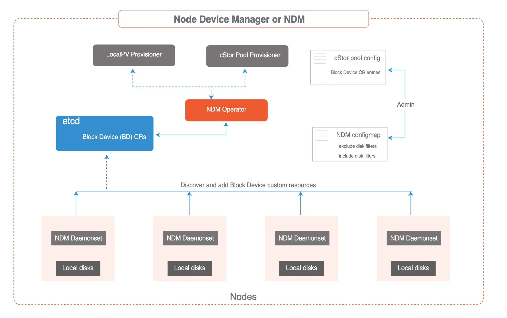

`Node Disk Manager` (`NDM`)填补了使用 Kubernetes 管理有状态应用的持久性存储所需的工具链中的空白。容器时代的 DevOps 架构师必须以自动化的方式服务于应用和应用开发者的基础设施需求，以提供跨环境的弹性和一致性。这些要求意味着存储栈本身必须非常灵活，以便 Kubernetes 和云原生生态系统中的其他软件可以轻松使用这个栈。NDM 在 Kubernetes 的存储栈中起到了基础性的作用，它将不同的磁盘统一起来，并通过将它们识别为 Kubernetes 对象来提供部分池化的能力。同时， NDM 还可以发现、供应、监控和管理底层磁盘，这样Kubernetes PV 供应器（如 OpenEBS 和其他存储系统和Prometheus）可以管理磁盘子系统。

{ loading=lazy }

## 内置 filter

用户可以仅包含选定的块设备来创建块设备 CR，然后仅使用创建的块设备 CR 来创建 cStor 池或用于基于设备配置本地 PV。 为了包含选定的块设备，请在 NDM 配置部分下使用所需的块设备更新操作员 YAML 文件，以便仅使用这些块设备来创建块设备 CR。 在以下配置中添加块设备路径以指定特定磁盘。 此配置必须添加到 `openebs-operator.yaml` 中 `Configmap` 下的 `openebs-ndm-config` 中。

此更改必须在 OpenEBS 安装之前下载的 `openebs-operator.yaml` 文件中完成。 如果在 OpenEBS 安装后执行更改，则用户必须重新启动相应的 NDM DaemonSet Pod 才能更新 NDM 配置。

```yaml
filterconfigs:
- key: path-filter
  name: path filter
  state: true
  include: "/dev/sda"
  exclude: ""
```

使用上述配置时，仅使用块设备`/dev/sda`来创建块设备自定义资源。 所有其他磁盘将被排除。

!!! warning "注意"

    NDM Configmap 中的过滤器配置不支持正则表达式，并且 Configmap 适用于集群级别。 这意味着，如果用户在 `filterconfigs` 中提供 `/dev/sdb` 作为包含过滤器，则集群中所有节点的所有 `/dev/sdb` 块设备将用于由 NDM 创建块设备 CR。

## 排除 filter

NDM 对要排除的磁盘进行一些过滤，例如启动磁盘。 默认情况下，NDM 在创建块设备 CR 时排除以下设备路径。 此配置添加到 `openebs-operator.yaml` 中 Configmap 下的 `openebs-ndm-config` 中。

```bash
/dev/loop - loop devices.
/dev/fd - file descriptors.
/dev/sr - CD-ROM devices.
/dev/ram - ramdisks.
/dev/dm -lvm.
/dev/md -multiple device ( software RAID devices).
/dev/rbd - ceph RBD devices
/dev/zd - zfs volumes
```

以下是来自 openebs 操作员 YAML 的 NDM 配置文件片段，其中不包括提供的磁盘/路径。

```bash
filterconfigs:
  - key: os-disk-exclude-filter
    name: os disk exclude filter
    state: true
    exclude: "/,/etc/hosts,/boot"
  - key: vendor-filter
    name: vendor filter
    state: true
    include: ""
    exclude: "CLOUDBYT,OpenEBS"
  - key: path-filter
    name: path filter
    state: true
    include: ""
    exclude: "loop,/dev/fd0,/dev/sr0,/dev/ram,/dev/dm-,/dev/md,/dev/rbd"  
```

还可以通过添加更多与节点关联的磁盘类型来进行自定义。 例如，已用磁盘、不需要的磁盘等。

此更改必须在 OpenEBS 安装之前下载的 `openebs-operator.yaml` 文件中完成。 如果在 OpenEBS 安装后执行更改，则用户必须重新启动相应的 NDM DaemonSet Pod 才能更新 NDM 配置。

```bash
filterconfigs:
  - key: path-filter
    name: path filter
    state: true
    include: ""
    exclude: "loop,/dev/fd0,/dev/sr0,/dev/ram,/dev/dm-,/dev/md,/dev/sdb"
```

!!! note "备注"

    NDM Configmap 中的过滤器配置不支持正则表达式，并且 Configmap 适用于集群级别。 这意味着，如果用户在 configmap 中提供 `/dev/sdb` 作为排除过滤器，则集群中所有节点的所有 `/dev/sdb` 块设备都将被 NDM 排除。

    建议在集群中单独使用OpenEBS Provisioner。 如果您将其他存储提供程序配置程序（例如 `gce-pd`）与 OpenEBS 一起使用，请使用排除过滤器以避免 OpenEBS 消耗这些磁盘。 例如，如果您在 GKE 中使用标准存储类，存储配置程序为 `kubernetes.io/gce-pd`，并且当它创建 PVC 时，GPD 会附加到该节点。 该 GPD 将由 NDM 检测到，并且 OpenEBS 可以使用它来配置卷。 为了避免这种情况，建议将节点上创建的关联设备路径放在路径过滤器下的排除字段中。 如果 GPD 作为 `/dev/sdc` 附加，则在上述字段中添加 `/dev/sdc` 。


在下载的 `openebs-operator.yaml` 中，找到 `openebs-ndm-config` configmap 并根据需要更新路径过滤器和任何其他过滤器的值。

```yaml linenums="1"
---
# This is the node-disk-manager related config.
# It can be used to customize the disks probes and filters
apiVersion: v1
kind: ConfigMap
metadata:
 name: openebs-ndm-config
 namespace: openebs
data:
 # udev-probe is default or primary probe which should be enabled to run ndm
 # filterconfigs contains configs of filters - in their form fo include
 # and exclude comma separated strings
 node-disk-manager.config: |
   probeconfigs:
     - key: udev-probe
       name: udev probe
       state: true
     - key: seachest-probe
       name: seachest probe
       state: false
     - key: smart-probe
       name: smart probe
       state: true
   filterconfigs:
     - key: os-disk-exclude-filter
       name: os disk exclude filter
       state: true
       exclude: "/,/etc/hosts,/boot"
     - key: vendor-filter
       name: vendor filter
       state: true
       include: ""
       exclude: "CLOUDBYT,OpenEBS"
     - key: path-filter
       name: path filter
       state: true
       include: ""
       exclude: "loop,/dev/fd0,/dev/sr0,/dev/ram,/dev/dm-,/dev/md,/dev/sdc"
---
```

## 为不支持的磁盘创建块设备 CR

目前，NDM 开箱即用，可以管理`disk`、`partition`、`lvm`、`crypt` 和其他 `dm` 设备。 如果用户需要为其他设备类型（例如 `md` 阵列或任何其他不支持的设备类型）拥有 `blockdevice`，则可以使用以下步骤手动创建 `blockdevice` 资源：

使用以下规范创建示例块设备 CR YAML。 以下是示例块设备 CR YAML。

```yaml linenums="1"
apiVersion: openebs.io/v1alpha1
kind: BlockDevice
metadata:
   name: example-blockdevice-1
   labels:
     kubernetes.io/hostname: <host name in which disk/blockdevice is attached> # like gke-openebs-user-default-pool-044afcb8-bmc0
     ndm.io/managed: "false" # for manual blockdevice creation put false
     ndm.io/blockdevice-type: blockdevice
status:
   claimState: Unclaimed
   state: Active
spec:
   capacity:
     logicalSectorSize: 512
     storage: <total capacity in bytes> #like 53687091200
   details:
     deviceType: <device type> # like disk, partition, lvm, crypt, md
     firmwareRevision: <firmware revision>
     model: <model name of blockdevice> # like PersistentDisk
     serial: <serial no of disk> # like google-disk-2
     compliance: <compliance of disk> #like "SPC-4"
     vendor: <vendor of disk> #like Google
   devlinks:
   - kind: by-id
     links:
     - <link1> # like /dev/disk/by-id/scsi-0Google_PersistentDisk_disk-2
     - <link2> # like /dev/disk/by-id/google-disk-2
   - kind: by-path
     links:
     - <link1> # like /dev/disk/by-path/virtio-pci-0000:00:03.0-scsi-0:0:2:0
   nodeAttributes:
     nodeName: <node name> # output of `kubectl get nodes` can be used
   path: <devpath> # like /dev/md0
```

使用磁盘信息修改创建的块设备 CR 示例 YAML。 在上面的块设备 CR 示例规范中，在应用 YAML 之前必须填写以下字段。

| 字段名称         | 用途描述                                                                                                                       |
|:-------------|:---------------------------------------------------------------------------------------------------------------------------|
| `name`     | 为块设备 CR 提供唯一的名称。 在上面的 YAML 规范中，块设备 CR 的给定名称是 `example-blockdevice-1`                              |
| `kubernetes.io/hostname`        | 附加块设备的节点的主机名。	 |
| `storage` | 提供以字节为单位的存储容量，例如 53687091200。                      |
| `logicalSectorSize`| 块设备的逻辑扇区大小。 例如，512、4096 等。在上面的示例片段中提供了 512。 该值可以根据设备的逻辑扇区大小进行更改。|
| `deviceType`| 设备类型。 这可以从 `lsblk` 输出中获得。 例如：`lvm`、`crypt`、`nbd`、`md` 等|
| `links`| 对于 `by-id` 和 `by-path` 应填写此字段。 可以通过运行以下命令从工作节点获取这些详细信息 `udevadm info -q property -n <device_path>`|
| `nodeName`| 附加块设备的节点的名称。 `kubectl get Nodes` 的输出可用于获取该值。|
| `path`| 该值应类似于 `/dev/dm-0` 或 `/dev/md0`。|

应用修改后的 YAML 文件为提供的设备路径创建块设备 CR。

```bash
kubectl apply -f <blockdevice-cr.yaml> -n <openebs_namespace>
```

对每个不支持的设备重复相同的步骤，并为设备创建块设备 CR。

通过运行以下 `kubectl get blockdevice -n openebs` 命令验证是否已创建块设备。

!!! warning "注意"

    如果您要为不受支持的设备创建块设备 CR，则必须在排除过滤器下添加相应的磁盘，以便 NDM 不会选择特定磁盘来创建 BD。


